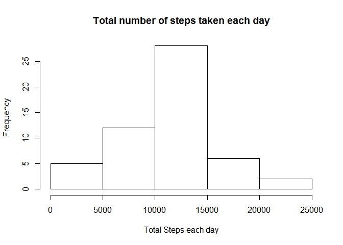
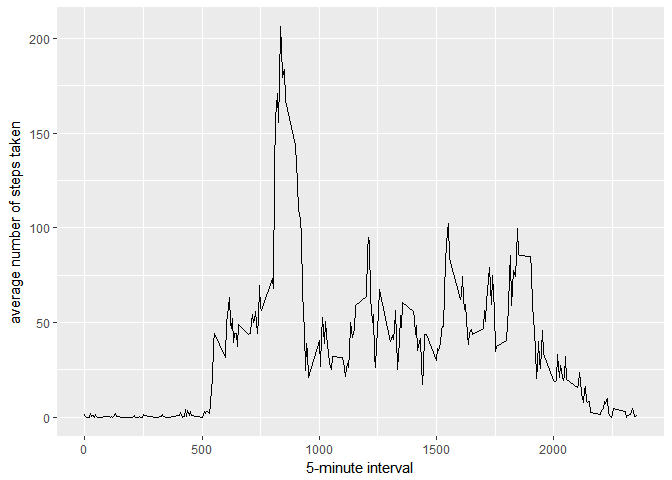
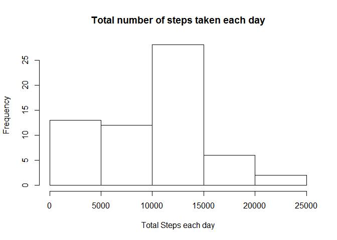
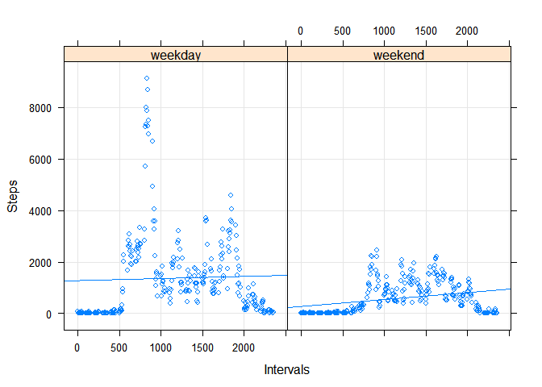

# Reproducible Research: Peer Assessment 1


## Loading and preprocessing the data


```r
library(dplyr)
library(ggplot2)
```


```r
ds<-read.csv(unzip("activity.zip"))
```


## What is mean total number of steps taken per day?
<h3>1 Calculate the total number of steps taken per day </h3>


```r
 totalPerDay<-ds%>%group_by(date)%>%summarise_at("steps", funs(sum))
```

<h3> 2. Make a histogram of the total number of steps taken each day </h3>

```r
hist(totalPerDay$steps, xlab = "Total Steps each day", main="Total number of steps taken each day")
```

<!-- -->

<h3> 3. Calculate and report the mean and median total number of steps taken per day</h3>
<LI>Mean: 1.0766189\times 10^{4}
</LI>
<LI>Median: 10765
</LI>

## What is the average daily activity pattern?
<h3> 1 Make a time series plot (i.e. type = "l") of the 5-minute interval (x-axis) and the average number of steps taken, averaged across all days (y-axis)
</h3>

```r
avgIntervalPattern<-ds%>%group_by(interval)%>%summarise_at("steps", funs(mean(., na.rm = TRUE)))

ggplot(data=avgIntervalPattern, aes(x=interval, y=steps)) +
     geom_line() +
     xlab("5-minute interval") +
     ylab("average number of steps taken") 
```

<!-- -->
<h3> 2 Which 5-minute interval, on average across all the days in the dataset, contains the maximum number of steps?
</h3>

```r
maxInterval<-avgIntervalPattern%>%filter(steps==max(steps))%>%select(interval)
```
<LI> 5-minute interval containing maxinum number of steps: 835</LI>
<LI> Average total step is 206.1698113</LI>

## Imputing missing values
<h3> 1 Calculate and report the total number of missing values in the dataset (i.e. the total number of rows with NAs)</h3>

```r
 missingTotalCount<-length(ds[is.na(ds$steps),]$date)
```
<OL>
<LI> There are 2304 of missing values in the dataset </LI>
</OL>

<h3>2 Devise a strategy for filling in all of the missing values in the dataset. The strategy does not need to be sophisticated. For example, you could use the mean/median for that day, or the mean for that 5-minute interval, etc.</h3>


```r
activity2 <- ds
missingDates<-activity2$date[is.na(activity2$steps)]
meanPerDay<-activity2%>%group_by(date)%>%summarise_at("steps", funs(mean))
meanPerDay[is.na(meanPerDay$steps),]$steps<-0

for(i in length(missingDates)){
  activity2[is.na(activity2$steps),]$steps<-meanPerDay[meanPerDay$date == missingDates[i],]$steps
}
```
<h3>3. Create a new dataset that is equal to the original dataset but with the missing data filled in. The new data set is activity2:</h3>


```r
summary(activity2)
```

```
##      steps                date          interval     
##  Min.   :  0.00   2012-10-01:  288   Min.   :   0.0  
##  1st Qu.:  0.00   2012-10-02:  288   1st Qu.: 588.8  
##  Median :  0.00   2012-10-03:  288   Median :1177.5  
##  Mean   : 32.48   2012-10-04:  288   Mean   :1177.5  
##  3rd Qu.:  0.00   2012-10-05:  288   3rd Qu.:1766.2  
##  Max.   :806.00   2012-10-06:  288   Max.   :2355.0  
##                   (Other)   :15840
```

<h3>4. Make a histogram of the total number of steps taken each day and Calculate and report the mean and median total number of steps taken per day. Do these values differ from the estimates from the first part of the assignment? What is the impact of imputing missing data on the estimates of the total daily number of steps? </h3>

```r
 act2_totalPerDay<-activity2%>%group_by(date)%>%summarise_at("steps", funs(sum))
 hist(act2_totalPerDay$steps, xlab = "Total Steps each day", main="Total number of steps taken each day")
```

<!-- -->
<h3> 5 . Calculate and report the mean and median total number of steps taken per day</h3>
<LI>Mean: 9354.2295082
</LI>
<LI>Median: 1.0395\times 10^{4}
</LI>


## Are there differences in activity patterns between weekdays and weekends?


```r
  activity2$dayOfWeek <- "weekday"

  wds<-weekdays(as.Date(activity2$date))  
  for(i in 1:length(wds)) 
  { 
    if( wds[i] == "Saturday" | wds[i] == "Sunday" ) { 
        activity2[i,"dayOfWeek"] <- "weekend" 
    }
  }
```

<h3>Make panel plot containing a time series plot</h3>

```r
library(lattice)
```

```
## Warning: package 'lattice' was built under R version 3.3.3
```

```r
stepsIntervalAggr <- aggregate(steps ~ interval + dayOfWeek, data = activity2, FUN = sum)
xyplot(stepsIntervalAggr$steps ~ stepsIntervalAggr$interval|stepsIntervalAggr$dayOfWeek, grid = TRUE, type = c("p", "r"), xlab = "Intervals", ylab = "Steps")
```

<!-- -->

